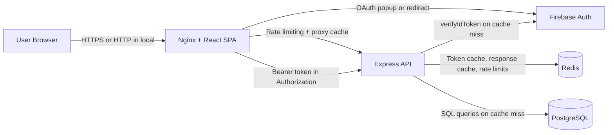

# Contact Manager Architecture

Last updated: March 27, 2026

## 1. System Overview

Contact Manager is a full-stack web application with:

- React SPA frontend served by Nginx
- Firebase Authentication (Google and GitHub OAuth)
- Express API protected by Firebase Admin token verification
- Redis for caching, rate limiting, and token verification
- PostgreSQL persistence (per-user contact isolation)
- Docker Compose local orchestration

Primary local endpoints:

- Frontend: http://localhost:3000
- API: http://localhost:3001
- API docs: http://localhost:3001/api-docs
- Postgres: localhost:5432
- Redis: localhost:6379

## 2. High-Level Architecture

## 3. Runtime Components

### Frontend container

- Source: frontend/
- Build: multi-stage Docker build (Node build stage + Nginx runtime)
- Responsibilities:
  - Serve static SPA assets
  - Route all non-file paths to index.html
  - Reverse proxy /api/\* to backend service
  - Nginx-level rate limiting (10 req/sec per IP with burst=20 for API calls)
  - Nginx-level proxy response caching (60s TTL, keyed per user)
  - Emit security headers (CSP, frame protections, referrer policy, etc.)

### API container

- Source: server-api/
- Runtime: Node.js + Express
- Responsibilities:
  - Validate Firebase ID tokens (with Redis-backed token cache, 5 min TTL)
  - Enforce user-level data scoping on all contact routes
  - Validate request payload basics for write operations
  - Expose Swagger docs and health endpoint
  - Enforce global and write-specific rate limits (Redis-backed store)
  - Cache API responses in Redis (60s TTL, invalidated on writes)

### Redis container

- Engine: Redis 7 (alpine)
- Persistent volume: redisdata
- Used for:
  - Rate limit counter storage (shared across restarts and replicas)
  - API response caching (GET /contacts, GET /contacts/:id)
  - Firebase token verification caching (SHA-256 hashed token key)

### Database container

- Engine: PostgreSQL 17 (alpine)
- Schema bootstrap: server-api/db/init.sql
- Contacts table stores user_id, name, phone, created_at

## 4. Frontend Architecture

Key modules:

- Auth context: frontend/src/contexts/AuthContext.js
  - Handles OAuth login/logout
  - Falls back popup login to redirect when popup fails
  - Converts common Firebase auth errors to user-friendly messages
- Firebase bootstrap: frontend/src/firebase.js
  - Reads REACT*APP_FIREBASE*\* config
  - Guards against missing config
- API data layer: frontend/src/features/apiSlice.js
  - RTK Query base query
  - Injects Firebase ID token in Authorization header when present
- Routing: frontend/src/App.js
  - Protected routes for contacts pages
  - Public login route

## 5. API Architecture

Core endpoints:

- GET /healthz (unauthenticated)
- GET /api-docs (unauthenticated)
- GET /contacts (authenticated)
- GET /contacts/:id (authenticated)
- POST /contacts (authenticated + write rate limit)
- DELETE /contacts/:id (authenticated + write rate limit)

Authentication flow:

1. Frontend obtains Firebase user session
2. Frontend sends ID token as Bearer token
3. API hashes token (SHA-256) and checks Redis cache
4. On cache miss, API verifies token via Firebase Admin SDK and caches result (5 min TTL)
5. API maps decoded uid to req.userId
6. SQL queries enforce WHERE user_id = req.userId

## 6. Data Model

contacts table:

- id: UUID primary key
- user_id: string (Firebase uid)
- name: string
- phone: string
- created_at: timestamp default now

Index:

- idx_contacts_user_id on user_id
- idx_contacts_user_created on (user_id, created_at DESC)

## 7. Deployment and Delivery

Local orchestration:

- docker-compose.yml defines frontend, api, redis, postgres
- Health-based startup ordering:
  - redis starts independently with health check
  - api waits for postgres healthy and redis healthy
  - frontend waits for api healthy

CI/CD:

- CI pipeline: pipelines/ci.yml
  - Scan -> Test -> E2E -> Build
- CD pipeline: pipelines/cd.yml
  - Push images -> Deploy region
- Legacy router pipeline: azure-pipelines.yml

## 8. Cross-Cutting Concerns

### Security

- Firebase token verification on API (cached in Redis for 5 min)
- User-scoped SQL access control
- CORS handling for localhost origins
- Rate limiting (multi-layer):
  - Nginx: 10 req/sec per IP with burst=20 (first line of defense)
  - Express global: 100 requests per 15 minutes per IP (Redis-backed)
  - Express writes: 10 requests per minute per IP (Redis-backed)
- Nginx security headers and CSP

### Caching

- Nginx proxy cache: GET API responses cached 60s (keyed per URI + Authorization header)
- Redis response cache: GET /contacts and GET /contacts/:id cached 60s (keyed per user_id)
- Redis token cache: verified Firebase tokens cached 5 min (keyed by SHA-256 hash)
- Browser static asset cache: 1 year immutable for JS/CSS/images
- RTK Query client-side cache with tag-based invalidation
- Cache invalidation: POST and DELETE clear Redis caches for affected user

### Reliability

- Health checks for all containers
- Restart policy set to unless-stopped
- Frontend startup normalizes shell script line endings in image build

### Observability

- Basic server startup logs
- No centralized structured logging/tracing yet

## 9. Key Architectural Decisions

1. Firebase Auth for identity provider and token format consistency
2. Firebase Admin verification on backend for server-trust boundary
3. PostgreSQL for persistent multi-user data over file-based storage
4. RTK Query for cached data fetching and invalidation patterns
5. Nginx reverse proxy for frontend static hosting + API forwarding

## 10. Known Gaps and Improvement Targets

1. Refactor server-api/server.js into layered modules (router/service/repository)
2. Add structured logging and request correlation IDs
3. Tighten CORS policy for non-local deployments
4. Add request schema validation library for stronger payload contracts
5. Add migration tooling (instead of bootstrap SQL only)
6. Add TLS-first deployment defaults outside local development
