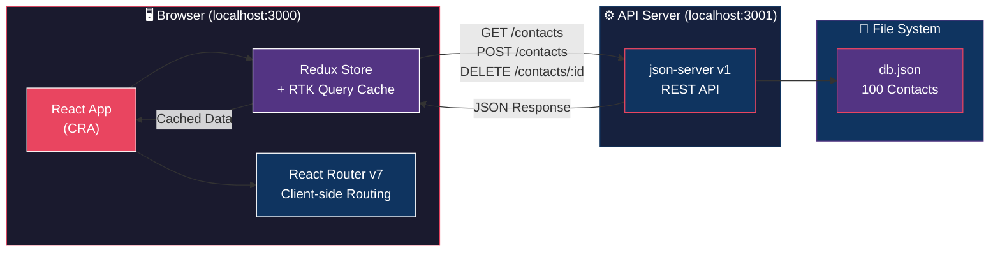
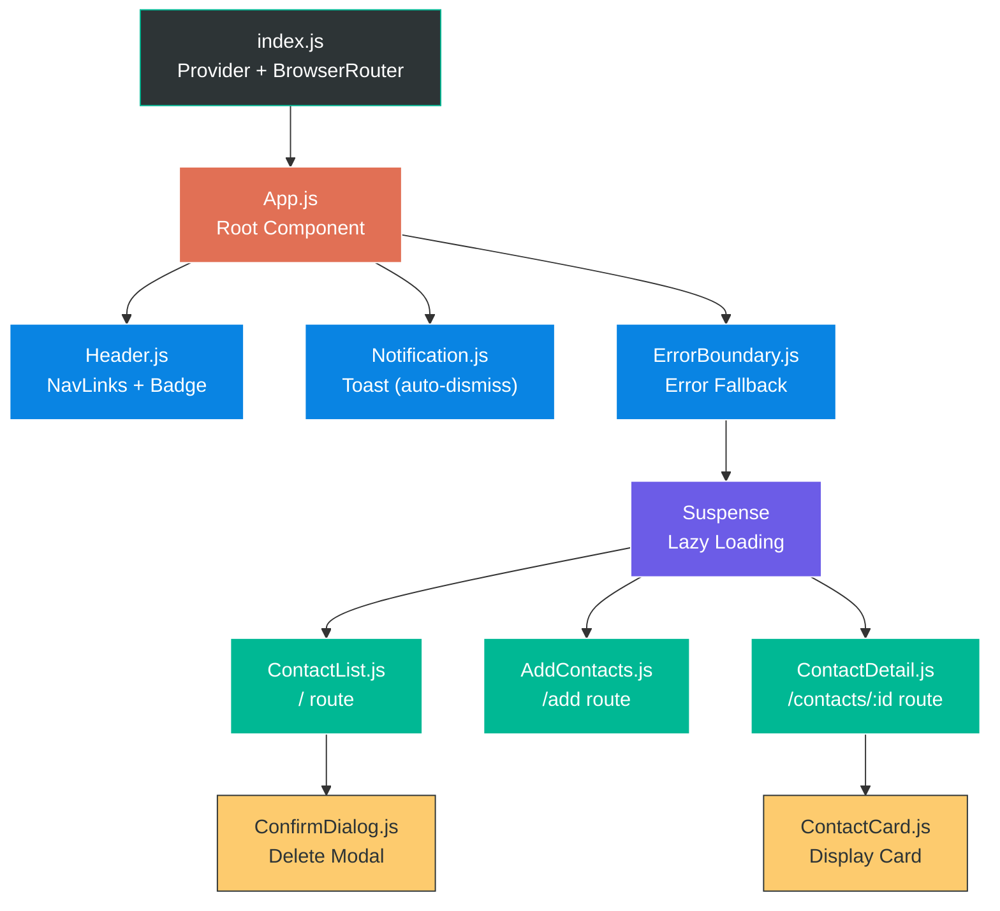
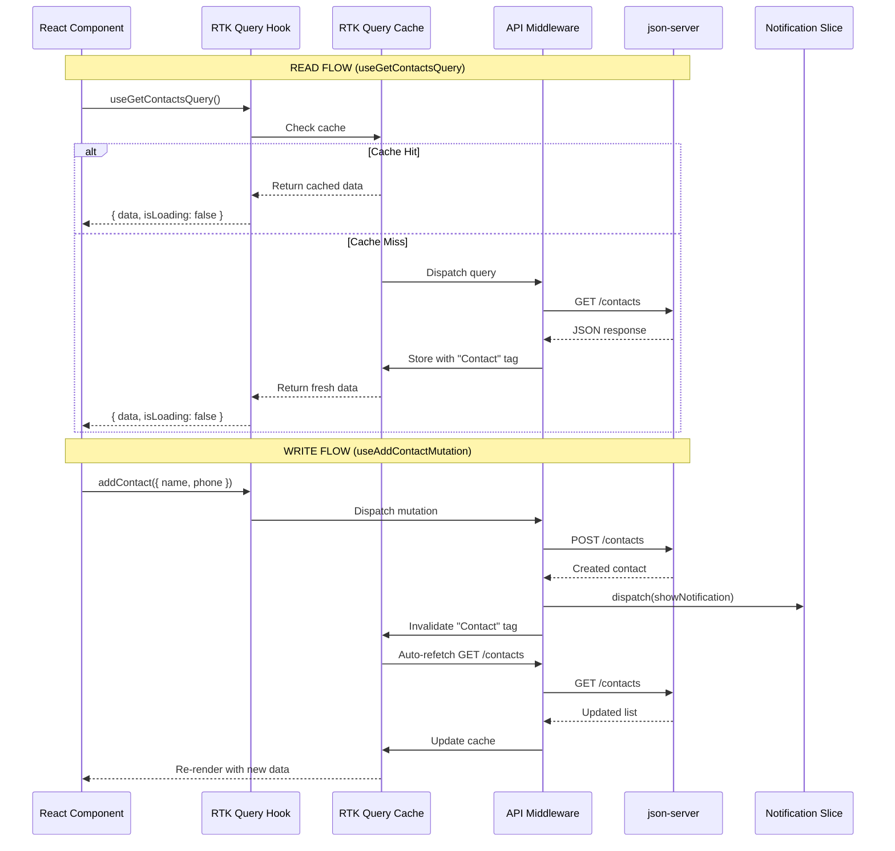

# Contact Manager — Architecture Diagrams

## 1. System Architecture

High-level view: Browser → React Frontend → json-server API → db.json

---

## 2. Component Hierarchy

React component tree: App → Header, Notification, Routes → Pages

---

## 3. RTK Query Data Flow

How data flows through the Redux store, RTK Query cache, and API

---

## 4. Folder Structure

Visual representation of the project layout

```mermaid
graph TD
    Root["contacts-app/"]

    FE["frontend/"]
    SRC["src/"]
    PUB["public/"]

    API_DIR["api/"]
    API_FILE["contacts.js"]

    APP_DIR["app/"]
    STORE["store.js"]

    COMP["components/"]
    COMP_UI["ui/"]
    HEADER["Header.js"]
    CARD["ContactCard.js"]
    CONFIRM["ConfirmDialog.js"]
    NOTIF["Notification.js"]
    ERRBND["ErrorBoundary.js"]

    FEAT["features/"]
    API_SLICE["apiSlice.js"]
    NOTIF_SLICE["notificationSlice.js"]
    BARREL1["index.js"]

    HOOKS["hooks/"]
    HELPERS["useContactHelpers.js"]
    BARREL2["index.js"]

    PAGES["pages/"]
    CL["ContactList.js"]
    CD["ContactDetail.js"]
    AC["AddContacts.js"]

    APP_JS["App.js"]
    APP_CSS["App.css"]
    INDEX_JS["index.js"]

    SA["server-api/"]
    DB["db.json"]
    PKG2["package.json"]

    E2E["e2e/"]
    POM["pages/"]
    SPECS["*.spec.js"]

    CONFIG["playwright.config.js"]
    README["README.md"]
    GIT[".gitignore"]
    ENV[".env"]

    Root --> FE
    Root --> SA
    Root --> E2E
    Root --> CONFIG
    Root --> README
    Root --> GIT

    FE --> SRC
    FE --> PUB
    FE --> ENV

    SRC --> API_DIR --> API_FILE
    SRC --> APP_DIR --> STORE
    SRC --> COMP
    COMP --> COMP_UI
    COMP --> HEADER
    COMP --> CARD
    COMP_UI --> CONFIRM
    COMP_UI --> NOTIF
    COMP_UI --> ERRBND

    SRC --> FEAT
    FEAT --> API_SLICE
    FEAT --> NOTIF_SLICE
    FEAT --> BARREL1

    SRC --> HOOKS
    HOOKS --> HELPERS
    HOOKS --> BARREL2

    SRC --> PAGES
    PAGES --> CL
    PAGES --> CD
    PAGES --> AC

    SRC --> APP_JS
    SRC --> APP_CSS
    SRC --> INDEX_JS

    SA --> DB
    SA --> PKG2

    E2E --> POM
    E2E --> SPECS

    style Root fill:#2d3436,stroke:#dfe6e9,color:#fff
    style FE fill:#0984e3,stroke:#fff,color:#fff
    style SA fill:#00b894,stroke:#fff,color:#fff
    style E2E fill:#6c5ce7,stroke:#fff,color:#fff
    style SRC fill:#74b9ff,stroke:#fff,color:#fff
    style COMP fill:#fd79a8,stroke:#fff,color:#fff
    style COMP_UI fill:#e17055,stroke:#fff,color:#fff
    style FEAT fill:#fdcb6e,stroke:#2d3436,color:#2d3436
    style HOOKS fill:#55efc4,stroke:#2d3436,color:#2d3436
    style PAGES fill:#a29bfe,stroke:#fff,color:#fff
```

