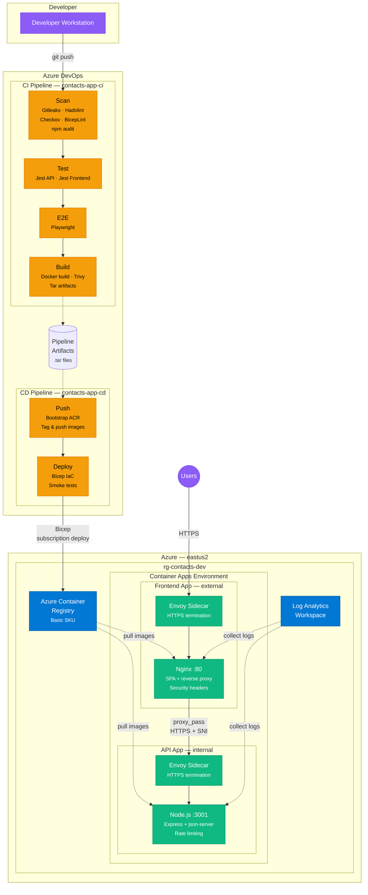

# Contact Manager

A modern React contact management application with a clean glassmorphism UI.

## Features

- **CRUD Operations** — Add, view, and delete contacts
- **Search & Filter** — Real-time search by name or phone number
- **Client-side Pagination** — 10 contacts per page with Prev/Next navigation
- **Notifications** — Toast notifications for add/delete actions (auto-dismiss + manual close)
- **Confirmation Dialogs** — Delete confirmation modal to prevent accidental deletions
- **Form Validation** — Zod schema validation with React Hook Form (inline error messages)
- **Contact Detail View** — Full-page view with avatar and contact info

## Tech Stack

- **React** — Functional components with hooks
- **Redux Toolkit** — Centralized state management with slices and async thunks
- **React Router** — Client-side routing (`/`, `/add`, `/contacts/:id`)
- **React Hook Form + Zod** — Schema-based form validation
- **Axios** — HTTP client for API calls
- **json-server** — Mock REST API

## Architecture

- **Lazy Loading** — Route components loaded on demand via `React.lazy` + `Suspense`
- **Error Boundaries** — Graceful error handling with fallback UI
- **Custom Hooks** — Shared utilities (`getInitials`)
- **Barrel Exports** — Clean imports via `index.js` files
- **Environment Variables** — API URL configured via `.env`
- **No Prop Drilling** — Components read from Redux store directly via `useSelector`

## Project Structure

```
frontend/
├── public/
├── src/
│   ├── api/
│   │   └── contacts.js          # API service layer (fetchAll, create, remove, etc.)
│   ├── app/
│   │   └── store.js             # Redux store configuration
│   ├── components/
│   │   ├── ui/
│   │   │   ├── ConfirmDialog.js # Delete confirmation modal
│   │   │   ├── Notification.js  # Toast notification component
│   │   │   └── ErrorBoundary.js # Error boundary wrapper
│   │   ├── Header.js            # Navigation header with badge
│   │   └── ContactCard.js       # Contact display card
│   ├── features/
│   │   ├── contactsSlice.js     # Contacts state, thunks, reducers
│   │   └── notificationSlice.js # Notification state management
│   ├── hooks/
│   │   └── useContactHelpers.js # Shared utility functions
│   ├── pages/
│   │   ├── ContactList.js       # Paginated contact list with search
│   │   ├── ContactDetail.js     # Contact detail page
│   │   └── AddContacts.js       # Add contact form with Zod validation
│   ├── App.js                   # Root component with routes
│   ├── App.css                  # Global styles
│   └── index.js                 # Entry point (Provider + BrowserRouter)
server-api/
├── db.json                      # Mock database (100 contacts)
└── package.json
```

## Getting Started

### Prerequisites

- Node.js (v16+)

### Installation

```bash
# Install frontend dependencies
cd frontend
npm install

# Install server dependencies
cd ../server-api
npm install
```

### Running the App

Start both servers:

```bash
# Terminal 1 — Start the API server
cd server-api
npm start
# Runs on http://localhost:3001

# Terminal 2 — Start the frontend
cd frontend
npm start
# Runs on http://localhost:3000
```

### Environment Variables

Create a `.env` file in the `frontend/` directory:

```
REACT_APP_API_URL=http://localhost:3001
```

## Deployment Architecture



### Pipeline Flow

| Pipeline | Stages                    | Purpose                                                                     |
| -------- | ------------------------- | --------------------------------------------------------------------------- |
| **CI**   | Scan → Test → E2E → Build | Security scans, unit/integration/E2E tests, Docker image build + Trivy scan |
| **CD**   | Push → Deploy             | Provision ACR, push images, deploy via Bicep, smoke tests                   |

### Azure Resources

| Resource           | SKU                | Details                                              |
| ------------------ | ------------------ | ---------------------------------------------------- |
| Resource Group     | —                  | `rg-contacts-dev` in `eastus2`                       |
| Container Registry | Basic              | Admin credentials, public access                     |
| Log Analytics      | PerGB2018          | 30-day retention                                     |
| Container Apps Env | —                  | Zone redundancy off (free tier)                      |
| API App            | 0.25 vCPU / 0.5 Gi | Internal ingress, min 1 replica, `/healthz` probes   |
| Frontend App       | 0.25 vCPU / 0.5 Gi | External ingress, scale-to-zero, Nginx reverse proxy |

### Infrastructure as Code

All infrastructure is defined in **Bicep** with subscription-level deployments:

```
pipelines/infra/
├── bootstrap.bicep          # RG + ACR (pre-push provisioning)
├── main.bicep               # Subscription-level orchestrator
└── modules/
    ├── acr.bicep             # ACR module
    └── resources.bicep       # ACR + Log Analytics + ACA Env + Apps
```
