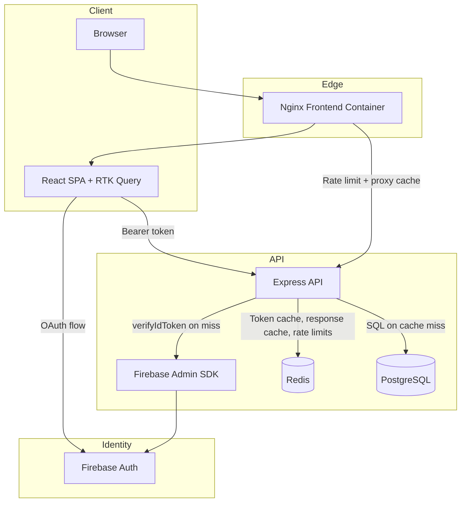

# Technology Stack Blueprint

Generated: March 27, 2026  
Project: contacts-app  
Depth: Comprehensive  
Source of truth: Current workspace code and configuration files

## 1. Technology Identification

### Detected project type

- Primary: JavaScript full-stack web application
- Frontend profile: React SPA
- Backend profile: Node.js/Express REST API
- Data profile: PostgreSQL
- DevOps profile: Docker Compose + Azure DevOps + Azure Bicep

### Detected languages

- JavaScript (frontend and backend)
- SQL (schema/bootstrap)
- YAML (pipelines and compose)
- Bicep (Azure IaC)
- Markdown (architecture and ops docs)
- Shell (container startup script)

## 2. Versioned Stack Inventory

### Frontend runtime and libraries

| Technology          |  Version | Purpose                                 |
| ------------------- | -------: | --------------------------------------- |
| react               |  ^19.2.4 | UI rendering and component model        |
| react-dom           |  ^19.2.4 | Browser rendering target                |
| react-router-dom    |  ^7.13.1 | Route and navigation handling           |
| @reduxjs/toolkit    |  ^2.11.2 | State management and RTK Query          |
| react-redux         |   ^9.2.0 | React bindings for Redux                |
| react-hook-form     |  ^7.71.2 | Form state and validation orchestration |
| zod                 |   ^4.3.6 | Schema validation                       |
| @hookform/resolvers |   ^5.2.2 | Zod integration with React Hook Form    |
| firebase            | ^12.10.0 | Auth and analytics SDK                  |
| react-scripts       |    5.0.1 | CRA build/test tooling                  |
| web-vitals          |   ^2.1.4 | Browser performance metrics             |

### Backend runtime and libraries

| Technology         |                       Version | Purpose                               |
| ------------------ | ----------------------------: | ------------------------------------- |
| node               | 22.x (pipelines / containers) | JavaScript runtime                    |
| express            |                        ^5.2.1 | HTTP API framework                    |
| pg                 |                       ^8.20.0 | PostgreSQL client/pool                |
| firebase-admin     |                       ^13.7.0 | Token verification and identity trust |
| express-rate-limit |                        ^8.3.1 | API throttling                        |
| ioredis            |                       ^5.10.1 | Redis client for caching and state    |
| rate-limit-redis   |                        ^4.3.1 | Redis store for express-rate-limit    |
| swagger-jsdoc      |                        ^6.2.8 | OpenAPI generation                    |
| swagger-ui-express |                        ^5.0.1 | Swagger UI hosting                    |

### Testing stack

| Technology                    |                  Version | Scope                          |
| ----------------------------- | -----------------------: | ------------------------------ |
| jest (frontend/react-scripts) | bundled by react-scripts | Frontend unit tests            |
| jest (server-api)             |                  ^30.3.0 | Backend unit/integration tests |
| supertest                     |                   ^7.2.2 | API endpoint tests             |
| @playwright/test              |                  ^1.58.2 | End-to-end tests               |

### Containers and infrastructure

| Technology         |           Version | Purpose                              |
| ------------------ | ----------------: | ------------------------------------ |
| node:22-alpine     |         image tag | Frontend build stage and API runtime |
| nginx:1.27-alpine  |         image tag | Frontend static hosting/proxy        |
| postgres:17-alpine |         image tag | Database service                     |
| redis:7-alpine     |         image tag | Caching, rate limiting, token cache  |
| Docker Compose     |         v2 syntax | Local orchestration                  |
| Azure Bicep        | current templates | Azure deployment IaC                 |

### Cloud deployment targets (IaC-defined)

- Azure Container Registry (Basic)
- Azure Log Analytics Workspace (PerGB2018)
- Azure Container Apps environment
- Azure Container App (frontend, external ingress)
- Azure Container App (api, internal ingress)

## 3. Layered Technology Map

### Presentation layer

- React SPA delivered by Nginx
- React Router for protected/public route partition
- CSS-based styling with app-level stylesheet

### Client application layer

- Auth Context controls login state and provider orchestration
- RTK Query API slice handles data fetching and mutation side effects
- Notification slice centralizes UX feedback

### API layer

- Express routes expose contacts and health/documentation endpoints
- Middleware stack enforces authentication, CORS, and rate limiting
- Swagger annotations embedded in route file

### Data layer

- PostgreSQL table contacts
- User-bound row access using Firebase uid
- SQL parameterization for query safety

### Platform and deployment layer

- Dockerized services for local and pipeline builds
- Azure DevOps CI (scan/test/e2e/build) and CD (push/deploy)
- Bicep modules for repeatable environment provisioning

## 4. Implementation Patterns

### Authentication pattern

1. Frontend authenticates with Firebase OAuth provider.
2. Client obtains ID token from authenticated user session.
3. RTK Query prepareHeaders injects Authorization Bearer token.
4. Backend verifies token via Firebase Admin SDK.
5. Backend binds decoded uid to request context and enforces row-level query scoping.

### API pattern

- REST-style contacts endpoints
- Single-file route/controller implementation (current state)
- Endpoint-specific rate controls for write operations (Redis-backed)
- Nginx-level rate limiting as first line of defense (10 req/sec per IP)
- JSON schema hints and examples via Swagger

### Data access pattern

- Direct SQL through pg Pool (no ORM)
- Parameterized statements
- Write validation before DB operation
- Descending created_at ordering for list retrieval
- Redis response cache (60s TTL) checked before DB queries
- Cache invalidated on write operations (POST/DELETE)

### Frontend state and side-effects pattern

- Server state: RTK Query cache + tag invalidation
- UI state: Redux slice for notifications
- Auth/session state: Context + Firebase auth observer
- Mutation feedback in onQueryStarted callbacks

### Container pattern

- Frontend uses multi-stage image build.
- Runtime config for proxy target via envsubst templating.
- API container runs non-root node user.
- Health checks on all services and dependency ordering in compose.

## 5. Coding and Organization Conventions

### Naming and file conventions

- React components/pages: PascalCase file names
- State modules/hooks/features: camelCase file names
- Tests colocated with feature/component where practical
- API routes and setup currently centralized in server.js

### Structural conventions

- frontend/src/features for redux toolkit slices and api slice
- frontend/src/contexts for auth boundary
- server-api/db for schema bootstrap SQL
- pipelines/templates for reusable CI/CD jobs
- pipelines/infra/modules for Bicep modules

### Security conventions in code

- Reject missing/invalid bearer tokens with 401
- Validate expected fields for contact writes
- Restrict CORS to localhost pattern in current setup
- Emit frontend security headers and CSP in Nginx

## 6. Usage Pattern Examples

### API token injection (client)

```javascript
prepareHeaders: async (headers) => {
  const user = auth.currentUser;
  if (user) {
    const token = await user.getIdToken();
    headers.set("Authorization", `Bearer ${token}`);
  }
  return headers;
};
```

### Token verification (server)

```javascript
const tokenHash = crypto.createHash("sha256").update(token).digest("hex");
const cacheKey = `auth:token:${tokenHash}`;
const cached = await redis.get(cacheKey);
if (cached) {
  req.userId = JSON.parse(cached).uid;
  return next();
}
const decoded = await admin.auth().verifyIdToken(token);
await redis.set(cacheKey, JSON.stringify({ uid: decoded.uid }), "EX", 300);
req.userId = decoded.uid;
```

### User-scoped query (server)

```javascript
const { rows } = await pool.query(
  "SELECT id, name, phone FROM contacts WHERE user_id = $1 ORDER BY created_at DESC",
  [req.userId],
);
```

## 7. Tooling, Build, and Delivery

### Local developer workflow

- Compose stack for all services
- Optional local split-run via npm start in frontend and server-api

### CI/CD workflow

- CI: Scan -> Test -> E2E -> Build
- CD: Push (ACR) -> Deploy (region)
- Parameterized image tags and environment suffixes

### Infrastructure workflow

- bootstrap.bicep for RG + ACR pre-provisioning
- main.bicep orchestrates full resource deployment
- resources.bicep defines Container Apps environment and app services

## 8. Stack Relationship Diagram



## 9. Constraints and Decision Context

1. React Scripts (CRA) build pipeline remains in use; migration to newer bundlers is not yet performed.
2. API implementation is currently monolithic in one file for simplicity; modular layering is a known next step.
3. Firebase config is build-time for Dockerized frontend and requires image rebuild on value changes.
4. Current CORS behavior is localhost-centric and should be environmentized for production hardening.
5. ACR admin credentials are used in IaC; managed identity is preferred for production security posture.

## 10. Blueprint Guidance for New Features

### Add a new API resource

1. Define schema/migration SQL in server-api/db.
2. Add authenticated route handlers using req.userId scoping.
3. Add request validation and rate policy where needed.
4. Extend Swagger annotations.
5. Add Jest + Supertest coverage.

### Add a new frontend domain feature

1. Add RTK Query endpoint(s) in apiSlice or dedicated feature slice.
2. Implement page/component in frontend/src/pages or components.
3. Add form validation schema and submit handlers.
4. Wire notification behavior for mutation outcomes.
5. Add component/unit and E2E test coverage.

### Add new environment/deployment capability

1. Add/extend Bicep module inputs and outputs.
2. Update CI/CD templates for image/env propagation.
3. Document new env variables in README and deployment docs.
4. Add smoke checks in pipeline stage.
